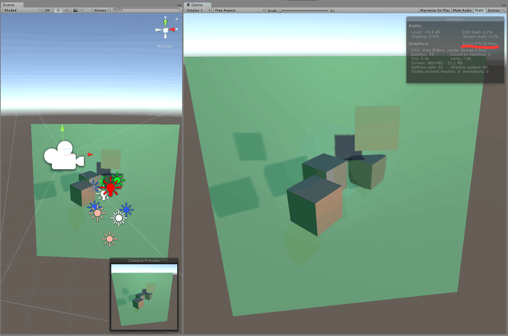
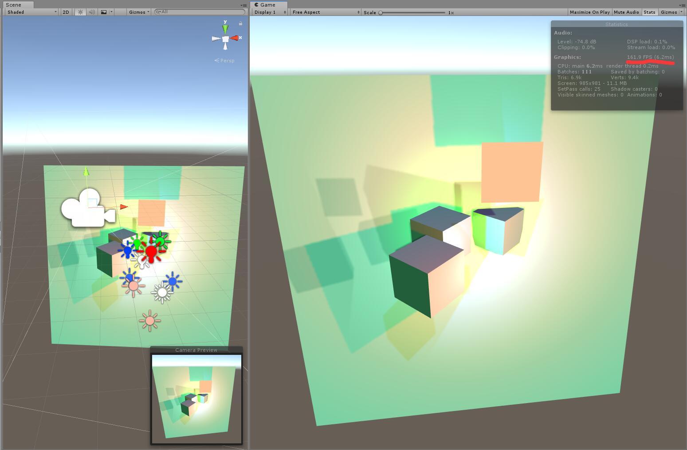
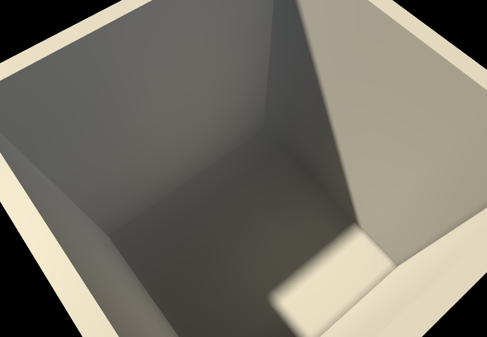
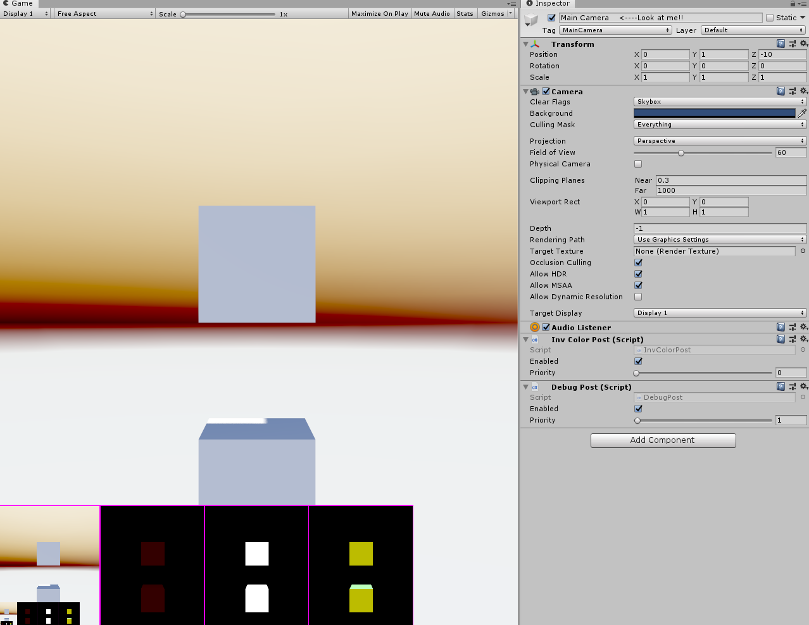

# READ ME

## Introduction

一个非常简单精简的自定义管线。

build-in pipeline

this scriptable pipeline

without GI

with GI

post process

## Log

2019.4.11 添加Postprocess

2019.4.10 添加Realtime probe GI

2019.3.26 添加Baked GI

2019.3.17 添加SH

2019.1.18 添加点光阴影

2019.1.14 添加平行光阴影

